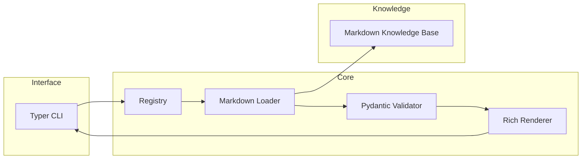
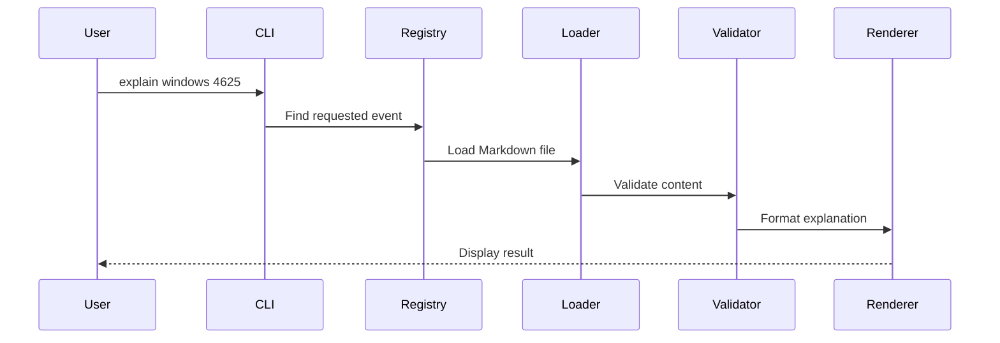
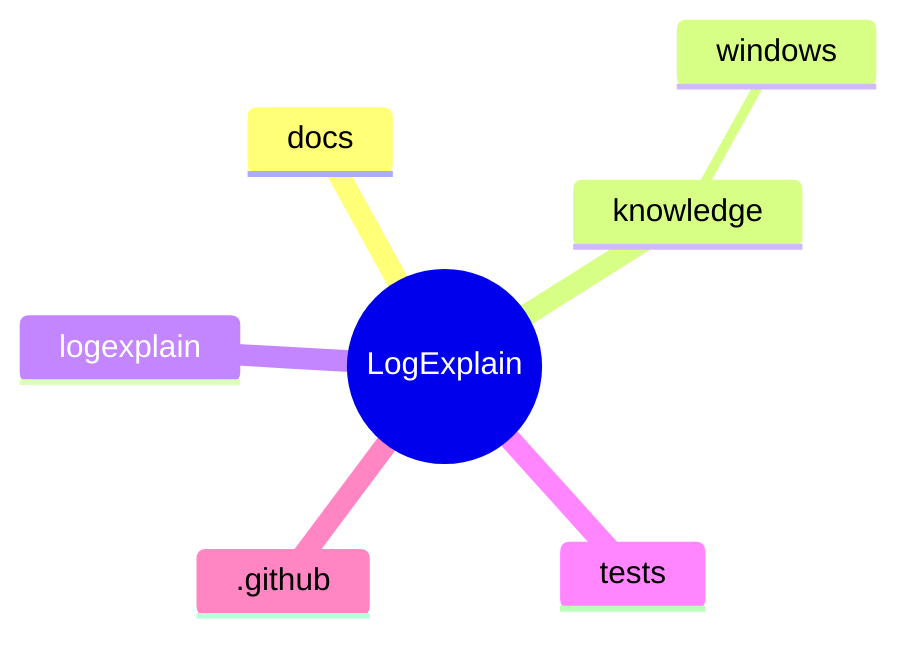
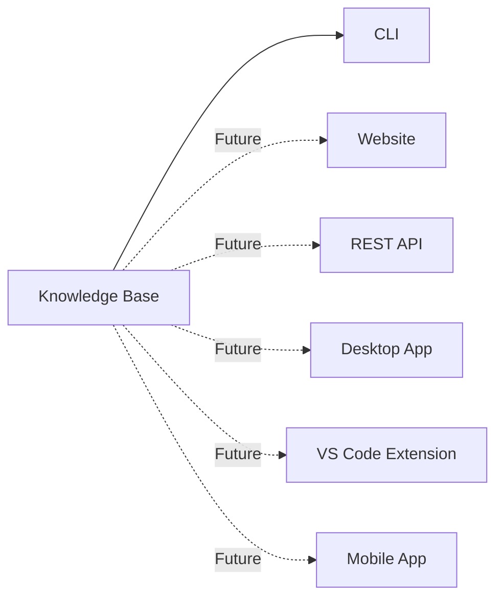

# 🏗 Architecture

> An overview of how LogExplain is organised and how its components work together to transform security events into educational explanations.

---

# 📖 Purpose

This document explains the technical architecture of LogExplain.

Its goal is to help contributors understand how the project is organised, how information flows through the application, and where different responsibilities belong.

This document focuses on **how** the project is built.

For the project's philosophy and design decisions, see **`design-principles.md`**.

---

# 🎯 Architecture Overview

LogExplain follows a simple layered architecture.

Educational content, application logic, and user interfaces are intentionally separated so that each part of the project has a single responsibility.

This design keeps the project modular while ensuring that educational content remains independent from the application itself.

---

# 🔄 Request Flow

Whenever a user requests an explanation, LogExplain follows the same predictable workflow.

Following the same workflow for every request keeps the application's behaviour consistent and predictable.

---

# 📦 Core Components

## 💻 Typer CLI

The command-line interface is the primary entry point in Version 0.1.

It receives user commands and passes requests to the application's internal components.

---

## 📚 Registry

The Registry acts as the application's coordinator.

It identifies the requested event and connects the command-line interface with the knowledge loading process.

---

## 📄 Markdown Loader

The Markdown Loader reads security event files from the knowledge base.

It extracts structured content and prepares it for validation.

---

## ✅ Pydantic Validator

The validation layer ensures that every knowledge base entry follows the expected schema before it is presented to users.

---

## 🎨 Rich Renderer

The renderer transforms validated data into a clear, readable terminal experience.

Presentation is handled here rather than inside the knowledge base.

---

## 📚 Knowledge Base

The knowledge base contains all educational content.

Each security event exists as an individual Markdown document, making the knowledge base the project's single source of truth.

---

# 📂 Repository Organization

Each top-level directory has a clearly defined responsibility.

| Directory     | Responsibility                                |
| ------------- | --------------------------------------------- |
| `docs/`       | Project documentation and contributor guides. |
| `knowledge/`  | Educational security event explanations.      |
| `logexplain/` | Python application source code.               |
| `tests/`      | Automated tests.                              |
| `.github/`    | GitHub workflows and community configuration. |

Keeping responsibilities separate makes the repository easier to understand, maintain, and contribute to.

---

# 🔮 Extensible Interfaces

Although Version **0.1** focuses on a command-line application, the architecture is designed so that additional interfaces can reuse the same knowledge base.

Because every interface reads from the same knowledge base, educational content only needs to be written once.

New interfaces can be introduced without duplicating explanations or changing the knowledge structure.

---

# 🔗 Related Documentation

Continue exploring the project through these documents:

* `design-principles.md` — Project philosophy and guiding principles.
* `knowledge-base-specification.md` — Structure of the Markdown knowledge base.
* `event-writing-guide.md` — Standards for writing educational content.
* `development-setup.md` — Setting up a local development environment.
* `roadmap.md` — Project milestones and future direction.

---

> *"A simple architecture is easier to understand, easier to maintain, and easier to grow."*
